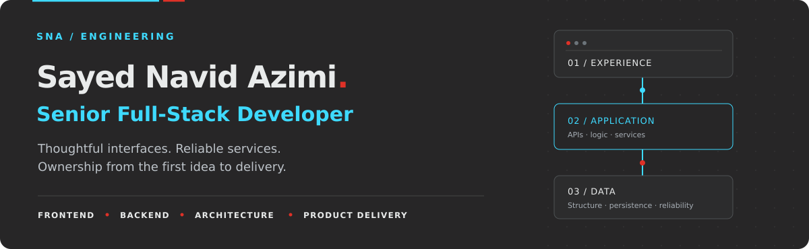
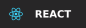
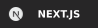
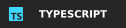
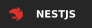
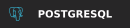

<!--
SNA palette: charcoal #272627 · cyan #3EDAFF · red #DF3127 · soft white #E9EBEB.
GitHub controls the page theme; brand colors are carried by the banner, technology badges, and streak card.
Upload README.md and the assets folder together. Static artwork is repository-local.
Public experience and project sources checked on 2026-09-29:
https://snavid.dev/work#experience
https://snavid.dev/work/projects/movie-af
https://snavid.dev/work/projects/cyborg-tech
https://snavid.dev/work/projects/enterprise-websites
https://github.com/snavid-dev
Company affiliations below are professional experience, not claims of public GitHub organization membership.
-->

  

  From thoughtful interfaces to reliable services. 
  I build across the stack and take ownership of the whole product.

  <a href="https://snavid.dev/work">Portfolio</a> &nbsp;·&nbsp;
  <a href="https://snavid.dev/resume">Résumé</a> &nbsp;·&nbsp;
  <a href="https://linkedin.com/in/snavid-dev">LinkedIn</a> &nbsp;·&nbsp;
  <a href="mailto:contact@snavid.dev">Email</a>

---

## Engineering with ownership

I'm a **Senior Full-Stack Developer** based in Afghanistan, working across frontend and backend with a strong foundation in systems and API design. My experience spans **React and Next.js interfaces, NestJS services, databases, and production web delivery**.

From 2020 to 2025, I founded and ran **Cyborg Tech**, combining hands-on full-stack development with architecture, client relationships, team leadership, and delivery. That experience shapes how I work: understand the problem, make the trade-offs clear, and stay accountable for the result.

- **Frontend:** responsive interfaces, reusable components, accessibility, and clear user journeys.
- **Backend:** well-defined APIs, authentication, caching, and maintainable service boundaries.
- **Delivery:** connect product requirements to technical decisions, keep code understandable, and improve what ships.

## Stack & focus

  
  
  
  
  
  
  
  

| Area | Technologies |
| :--- | :--- |
| **Frontend** | React · Next.js · TypeScript · JavaScript · HTML · CSS |
| **Backend** | Node.js · NestJS · Express · Python · REST APIs · Microservices |
| **Data & tooling** | PostgreSQL · MySQL · Redis · Docker · Linux · Git |
| **Web platforms** | PHP · WordPress · Laravel · CodeIgniter |

**Expanding into AI engineering:** applying Python, NumPy, and Pandas through practical work, while building toward deeper machine learning skills.

## Companies & teams

My professional experience spans engineering teams, client delivery, and building an agency.

| Organization | Role & contribution | Period |
| :--- | :--- | :--- |
| **Raha Ertebat** | Back End Developer — backend services and APIs | Jan 2026–present |
| **SkyTeams** | AI/ML Intern — Python, data, and modeling | Mar 2026–present |
| **Rahanet ISP** | Back End Engineer; previously Senior WordPress Developer | 2024–2026 |
| **Cyborg Tech** | Founder & CEO / Full-Stack Developer — architecture, team, clients, and delivery | 2020–2025 |
| **Parsa Technology** | Senior WordPress Developer — production websites and integrations | 2023–2024 |
| **Rezpardazan** | Full-Stack Developer Intern, then WordPress Developer Intern | 2018–2020 |

[Full experience →](https://snavid.dev/work#experience)

## Selected work

<table>
  <tr>
    <td width="50%" valign="top">
      <h3><a href="https://snavid.dev/work/projects/movie-af">Movie.af / Re-Movie ↗</a></h3>
      
<strong>Backend architecture</strong>

      
A movie platform with independent catalog, user, and delivery services connected through APIs.

      
<code>NestJS</code> <code>TypeScript</code> <code>Microservices</code>

    </td>
    <td width="50%" valign="top">
      <h3><a href="https://snavid.dev/work/projects/cyborg-tech">Cyborg Tech ↗</a></h3>
      
<strong>Founder &amp; full-stack developer</strong>

      
Five years of agency ownership, taking client projects from the initial brief through architecture and delivery.

      
<code>Full-stack</code> <code>Technical direction</code> <code>Delivery</code>

    </td>
  </tr>
  <tr>
    <td colspan="2" valign="top">
      <h3><a href="https://snavid.dev/work/projects/enterprise-websites">Enterprise websites &amp; integrations ↗</a></h3>
      
Custom web delivery for organizations including Parsa Technology, Saraf.af, AHD.World, and Muhaseb.af.

      
<code>WordPress</code> <code>PHP</code> <code>Integrations</code>

    </td>
  </tr>
</table>

**Public code:** [Next.js shop UI](https://github.com/snavid-dev/shop-next) · [NestJS shop backend](https://github.com/snavid-dev/shop-nest) · [NestJS + Redis caching](https://github.com/snavid-dev/nestjs-cache-redis)

[Explore all repositories →](https://github.com/snavid-dev?tab=repositories)

## A promise to myself

> **Make at least one meaningful GitHub commit every day.**

A feature, a fix, a test, or clearer documentation: I want each day to leave something better than I found it. This is my commitment to consistent practice, continuous learning, and steady progress.

  

  The live card tracks GitHub contributions, including commits, pull requests, and issues. My personal promise is specifically a daily commit. 
  <a href="https://github.com/snavid-dev#contributions">View contribution history</a>

---

  <strong>Have a product to build or a team to grow?</strong> 
  Open to remote full-stack and backend opportunities.  
  <a href="mailto:contact@snavid.dev">contact@snavid.dev</a> &nbsp;·&nbsp;
  <a href="https://snavid.dev/work">snavid.dev</a>

